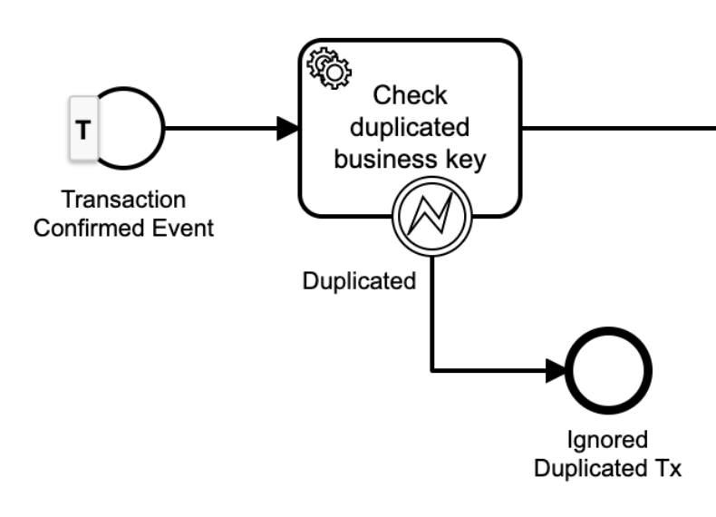

# Camunda BPM

Camunda BPM Enterprise on Spring Boot (including a delegate to call HTTP endpoints).

## Version

Please update the `version` file every time you make a change on the project (source or dependencies).

The version has 2 parts: `<camunda bpm version>-<extensions version>`

## Camunda Custom Config

- Changed default retries for jobs (10 retries in 5 minutes)
- Job executor acquisition polling (timings) & threads
- Default history retention (not including decisions due to a bug: https://jira.camunda.com/browse/CAM-13082)

## Custom Delegates

### Http Delegate Configuration

Can make HTTP requests and parse JSON responses as instance variables (only supports JSON body in the request and
response).

To call HTTP endpoints you must add to the bpmn:

- Service task
    - Implementation: `Delegate Expression`
    - Delegate Expression: `${http}`
- Input Parameters
    - url (required): type `Text` - Use expressions to parameterize the url (
      e.g. `${urls.service}/some/path?value=${aValue}`)
        - WARNING: variables inside `url` won't be URL escaped. You shouldn't use user provided values there (only
          values that are strictly safe for url usage).
        - To parameterize urls using env. variables, the property `skynet4ever.http.urls` can be used. It is available as
          a `Map` variable inside every process instance with the name `urls`.
    - method (optional, default: `GET`): type `Text` - The HTTP method to use, case-insensitive.
    - successStatusCode (optional, default: `[200]`): type `List` - Set of HTTP status code that will be interpreted as
      successful. If the response status code is not present in this list, the service task will throw an exception. If
      the config is provided via an instance variable, use a List (of String or Int) or a JSON array as string (
      e.g. `[200]`).
    - body (optional): type `Map` or type `Text` - Supports nested maps (e.g. `key=${otherMap}`) and JSON strings.
    - headers (optional): type `Map<String, String>` - Additional headers to send (e.g. `authorization`). If provided
      via an instance variable use a Map<String, String>, and also can be configured via the property `skynet4ever.http.headers`
        - Headers' name are case-insensitive.
    - authorization (optional): type `Text` - Shortcut to define the authorization header. It prepends `Bearer` before
      the actual value. It will override the authorization header if present in the previous config.
    - connectionTimeoutSecs (optional, default: 10 secs): type `Long` - Connection timeout in seconds (only mutable via
      properties).
    - readTimeoutSecs (optional, default: 30 secs): type `Long` - Read timeout in seconds.
    - expectedErrorCodes (optional): type `List` - Set of error codes that if returned, will be raised as `BpmnError` to
      be able to catch it. In any other error, a regular exception will be thrown to show the complete exception
      information on a Camunda incident.
- Output Parameters (as local variables)
    - statusCode: type `Long`
    - body: type `Map` - Java Map to allow ease of use in the flow expressions

#### Input Parameters Precedence

1. BPM instance variables
    1. authorization
    1. headers
    1. (other variables)
1. Env variables
1. Defaults

#### Error Events

- When the HTTP response is not successful, it tries to extract an error code and error message from the response
  body (`data.error.code` & `data.error.message`).
    - If an error code can be extracted, and it is configured in `expectedErrorCodes` a `BpmnError` will be thrown.
    - In any other case `UnsuccessfulResponseException` will be thrown.
- If any exception is thrown while executing this delegate, the same exception will be raised (it will be converted to
  an incident by the engine)

### Check Duplicated Business Key

------

#### BUG FOUND!

Camunda doesn't use DB's insert time when persisting processes, so a previous process if can't be persisted could be
retried later with the same values making the "start time" not suitable for process ordering nor deciding which process
id comes first.

To fix this we need to use a synchronous external service to decide which process instance id is the "first". One option
could be Redis because is fast and provides atomic operations like SETNX:

```
val key = "$definitionKey-$businessKey"
SETNX key processInstanceId
val firstProcessId = GETEX key EX 30days
if firstProcessId == null => retry
if firstProcessId != processInstanceId => throw error
if firstProcessId == processInstanceId => continue without exception
```

------

To avoid running process instances with the same business key as a previous process instance.

WARNING: This will only take into consideration instances that where NOT deleted. Instances are deleted automatically by
the cleanup job. The actual "idempotency window" will be dependent on the history cleanup TTL. If that is not enough for
your particular use case, you MUST create a custom check inside your business logic.

- Service task (as the first activity of the flow)
    - Implementation: `Delegate Expression`
    - Delegate Expression: `${checkDuplicatedBusinessKey}`
    - Asynchronous Continuations:
        - Asynchronous Before: true (in this activity or a previous one)
            - IMPORTANT: if the current process instance is not persisted yet, you won't find any duplicated instances!
        - Exclusive: true
- Error Boundary Event (over the service task)
    - Error Code: `business-key.duplicated`
- End Event (from the error boundary event)



### UUID Generator

To be able to generate UUIDs without a custom script. Can be used anywhere an expression can (e.g. input or output
variables) or as a Service Task.

- Input / Output variable: `${UUID.randomUUID()}`

or

- Service task
    - Implementation: `Expression`
    - Expression: `${UUID.randomUUID()}`

### Hash Functions

Transforms a variable length String into a Base64 encoded URL safe String (without padding).

Available Algorithms:

- `sha256`: 43 chars
- `sha512`: 86 chars

Can be used anywhere an expression can (e.g. input or output variables) or as a Service Task.

- Input / Output variable: `${Hash.sha256("value")}`

or

- Service task
    - Implementation: `Expression`
    - Expression: `${Hash.sha256("value")}`

#### WARNING!!!

If Camunda retries the activity, the generated UUID **WILL BE DIFFERENT**!!!

Please, **use asynchronous continuations** before using it as input variable to persist the process instance and have a
repeatable value even after retries.

### Deployments Cleanup

Process and DMN definitions are eagerly cached by the engine to provide good performance while executing instances. When
the number of definitions is too high, the amount of memory required to cached them in memory can be very high.

This is why we need a process that deletes deployments that are no longer in use.

References:

- https://forum.camunda.org/t/deployment-cache-clear/17021/2
- https://camunda.com/best-practices/cleaning-up-historical-data/
- https://docs.camunda.org/manual/7.15/user-guide/process-engine/deployment-cache/

### DEPRECATED! Sync Delay

-----

#### DEPRECATION NOTICE

At first seemed like a good performance improvement, but we can't scale the number of threads to handle higher
concurrency. We need to allow a little delay on each timer going back and forth the DB (that would be similar than
having external tasks).

-----

To wait synchronously for **SHORT** periods of time (and skip the cost of a timer job).

- Service task
    - Implementation: `Expression`
    - Expression: `${syncDelay.millis(1000)}`
    - Do NOT use an Asynchronous Continuation (use timers if a commit is needed)

## Getting Started

To run it locally before pushing the docker image to GitLab:

1. Build local image
   ```
   ./build.sh
   ```
1. Start docker compose
   ```
   cd deploy/local-dev
   ./compose-up.sh
   ```
1. Start web console:
    - http://localhost:8080
    - user: admin
    - password: admin
1. Start the test flow:
    1. Go to tasklist
    1. Click on Start Process
    1. Click on "testHttp"
    1. Enter the business key = "abc"
    1. Add a "userId" String variable = "123"
    1. Click start
1. Correlate messages with `MessagesManualTest#main`
1. See workflow history:
    1. Go to Cockpit (using the house in the top right corner)
    1. Click on "Processes" (top menu)
    1. Click on "testHttp"
    1. Click on "History" (second top menu)
1. To kill docker compose use
   ```
   ./compose-down.sh
   ```

# Install

To install Camunda BPM on an environment you need:

1. Create a new Postgres DB
    1. Make sure that the timezone on the database is
       UTC: https://docs.camunda.org/manual/latest/user-guide/process-engine/time-zones/
1. Run DB creation scripts manually or run the container for the first time on an empty database (it will create the
   schema for the current version).
1. Create a new index to acquire jobs by priority efficiently:
    ```sql
    create index act_idx_job_priority on act_ru_job (priority_ desc);
    ```

## Version Upgrade

1. Check if there are DB schema changes (minor or patch level updates): https://docs.camunda.org/manual/latest/update/
1. Check specific changes on functionality: https://docs.camunda.org/manual/latest/update/minor/
1. Migrate development environment and test extensively before moving it to production
    - Load testing
    - Integration & exploratory testing

## Infrastructure

Camunda only uses a Postgres DB to run. Additionally, we need to provide a "public" read only access for the support
team.


## Running the tests

```
./gradlew test
```
